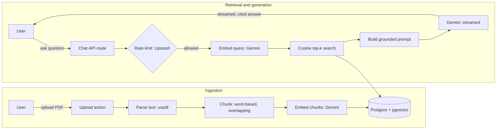

# DocQA, AI-Powered Document Q&A

[](https://github.com/vaidii2008/docqa/actions/workflows/ci.yml)

> Upload PDFs into private workspaces and ask questions in plain English. DocQA answers with streamed, cited responses drawn from your own documents. It is applied Retrieval-Augmented Generation (RAG) wrapped in a real, production-deployed product.

**Live demo:** [docqa-pied.vercel.app](https://docqa-pied.vercel.app)


---

## The problem

Finding one specific answer buried inside a long document is slow. DocQA lets you ask a question in natural language and get a precise, cited answer pulled from your own uploaded files, with each claim traceable back to the source passage it came from. No manual skimming, and no hallucinated answers from the model's training data.

## Features

- **Auth and private workspaces** — email/password auth; users only ever see their own documents.
- **Upload and parsing** — PDF to clean text to overlapping chunks, with a per-document processing state.
- **Semantic search** — vector similarity retrieval over embeddings using pgvector.
- **Streaming answers with citations** — token-by-token generation, grounded in retrieved passages and cited by number.
- **Persistent chat history** — conversations are saved per workspace.
- **Per-user rate limiting** — a sliding-window cap protects the upstream LLM quota and prevents abuse.

## Tech stack

| Layer            | Choice                                                        |
| ---------------- | ------------------------------------------------------------ |
| Framework        | Next.js 16 (App Router), TypeScript (strict)                 |
| Database         | PostgreSQL + pgvector                                         |
| ORM              | Prisma 7 (driver adapter; raw SQL for vector columns)        |
| Auth             | Auth.js v5 (NextAuth), credentials provider, JWT sessions    |
| AI / embeddings  | Vercel AI SDK + Google Gemini (`gemini-embedding-001`, `gemini-3.6-flash`) |
| Rate limiting    | Upstash Redis (`@upstash/ratelimit`, sliding window)         |
| Testing          | Vitest (unit) + Playwright (end-to-end)                      |
| CI/CD            | GitHub Actions + Vercel                                      |
| Hosting          | Vercel (app), Neon (Postgres), Upstash (Redis)              |

## Architecture



### How it works

**Ingestion (on upload):** the PDF is parsed to plain text, split into overlapping word-based chunks, embedded into 768-dimension vectors with Gemini, and stored in Postgres. The document's status moves from `PROCESSING` to `READY` (or `FAILED` if no text can be extracted).

**Retrieval (per question):** the question is embedded with the same model, then a single SQL query ranks the workspace's chunks by pgvector cosine distance and returns the top k. Because the query and documents share one embedding space, similarity is meaningful.

**Generation (streamed):** the retrieved passages are injected into the system prompt as numbered sources; the model is instructed to answer only from them and cite by number. The answer streams token-by-token to the browser, and the source list is rendered as citations. Both turns are persisted only after generation succeeds.

## Engineering decisions and trade-offs

These are the choices I would talk through in a review.

- **pgvector instead of a dedicated vector database.** Embeddings live in the same Postgres instance as the relational data, so nearest-neighbour search is one indexed SQL query with no separate store to run, sync, or pay for. An HNSW index (`vector_cosine_ops`) keeps search fast as the corpus grows by turning an O(n) scan into an approximate graph traversal.

- **Word-based chunking with overlap.** Documents are split into ~200-word chunks that overlap by ~40 words. Small chunks give precise retrieval and tight, cheap prompts; the overlap prevents an idea that straddles a chunk boundary from being lost to both neighbours. Splitting on word boundaries (rather than characters) is a tokenizer-free approximation that never cuts a word in half. The next step up would be a recursive splitter that prefers paragraph, then sentence, then word boundaries.

- **Grounded, cited generation.** Citations come from the RAG prompt: retrieved passages are numbered, the model must answer only from them, cite by number, and explicitly decline when the context does not cover the question. This anchors answers to the user's documents and makes every claim traceable, which is the main mitigation against hallucination.

- **Rate limiting below the provider's quota.** A per-user sliding window (keyed by the session user id) is set just under the LLM provider's free-tier limit, so the limiter absorbs bursts and returns a clean 429 before ever spending an upstream call. The counter lives in Redis, so it stays consistent across serverless instances where in-memory state could not.

- **Background embedding via a message queue.** Ingestion is split in two. The upload request extracts text, chunks it, and stores the chunk rows with null vectors, which is CPU bound and fast. It then publishes a job to Upstash QStash and returns immediately with the document in `PROCESSING`. QStash delivers the job over HTTP to a signed worker route, which embeds the chunks and flips the document to `READY`; the dashboard polls until it does. The worker only ever selects chunks whose embedding is null, so it is idempotent: QStash guarantees at-least-once delivery, and that is only safe if a redelivered message is a no-op. Retries and the dead-letter queue belong to QStash, and the worker deliberately does not mark a document `FAILED` on error, because a transient rate limit from the embedding provider should become a retry rather than a permanently broken document.

- **Why a queue rather than `waitUntil` or a cron-drained job table.** `waitUntil` needs no infrastructure but has no retries and no visibility, so a killed function strands a document in `PROCESSING` with nothing to recover it. A job table drained by cron is durable, but Vercel's Hobby plan caps cron at one run per day, which would mean waiting until tomorrow for an upload to finish. QStash gives retries, a dead-letter queue, and request signing without hand-rolling queue semantics, and runs locally through its dev server so the code path under test is the one that ships. Honest caveat: at current document sizes the synchronous path was already fast (a 19-chunk PDF completed in under two seconds, with extraction rather than embedding dominating the request), so this is the scaling path rather than a fix for a timeout I was actually hitting.

- **JWT sessions.** With a credentials provider, the session is a signed token in an httpOnly cookie rather than a database row, so there is no per-request database lookup to authenticate: a good fit for serverless. The user id is stamped into the token and used to scope every query, which closes the most common access-control hole (IDOR).

## Local development

### Prerequisites

- Node.js 22+ (an LTS release)
- pnpm 11+
- Docker (for local Postgres + pgvector)

### Setup

```bash
# 1. Clone and install (postinstall generates the Prisma client)
git clone https://github.com/vaidii2008/docqa.git
cd docqa
pnpm install

# 2. Configure environment
cp .env.example .env
# then fill in .env:
#   AUTH_SECRET                    generate with: openssl rand -base64 32
#   GOOGLE_GENERATIVE_AI_API_KEY   from https://aistudio.google.com
#   UPSTASH_REDIS_REST_URL/TOKEN   from https://console.upstash.com
# DATABASE_URL is preset to the local Docker database.

# 3. Start Postgres + Redis
docker compose up -d

# 4. Apply migrations (schema, pgvector, HNSW index)
pnpm prisma migrate deploy

# 5. Run the app
pnpm dev
```

The app runs at `http://localhost:3000`.

### Scripts

```bash
pnpm dev          # start the dev server
pnpm build        # production build (generates the Prisma client first)
pnpm typecheck    # tsc --noEmit
pnpm lint         # eslint
pnpm test:run     # Vitest unit tests
pnpm test:e2e     # Playwright end-to-end test (needs Docker + a Gemini key)
```

## Testing

- **Unit tests (Vitest)** cover the pure RAG logic: the chunking algorithm (empty input, boundaries, overlap correctness, guard clauses) and the prompt builder (source numbering, grounding instructions).
- **End-to-end test (Playwright)** drives the critical path in a real browser: sign up, log in, upload a PDF, and confirm it reaches `READY`. It deliberately stops before the non-deterministic LLM step to stay reliable.
- **CI (GitHub Actions)** runs typecheck, lint, and unit tests on every push and pull request.

## Deployment

The app is deployed on **Vercel**, with **Neon** for serverless Postgres (queries go through Neon's pooled connection; migrations use a direct connection) and **Upstash** for Redis. Two production-only lessons worth noting: Next.js Server Actions cap request bodies at 1 MB by default (raised to match the upload validation), and the gitignored Prisma client must be generated in the build command because dependency caching can skip the postinstall hook.

## Known limitations and future work

- **Scanned / image-only PDFs are not supported.** There is no text layer to extract and embed, so they fail gracefully with a clear message. Adding OCR (for example Tesseract) is the natural next step.
- **Math notation renders as raw LaTeX.** Answers render Markdown but not math; a `remark-math` plugin would fix this.
- **Single default workspace per user.** The multi-workspace data model is in place; the management UI is future work.

## License

[MIT](./LICENSE)
